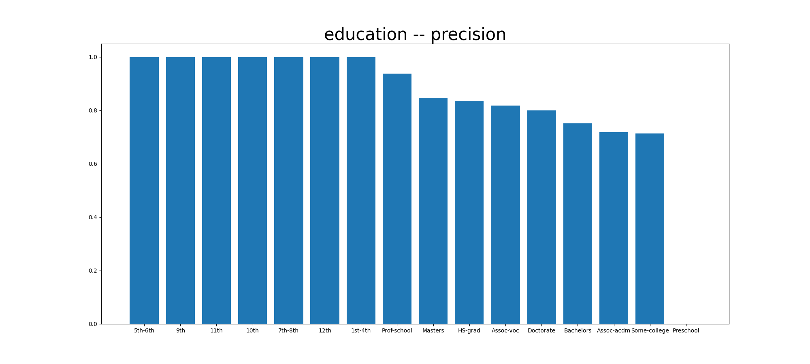
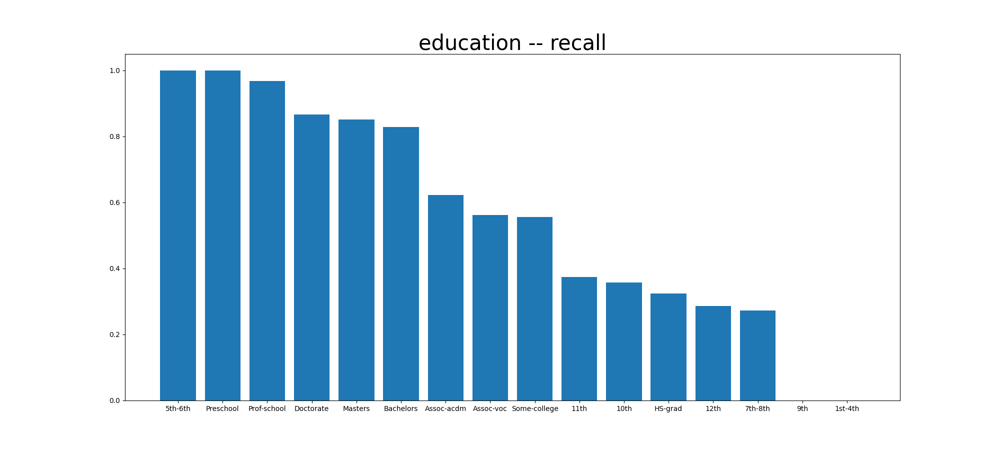
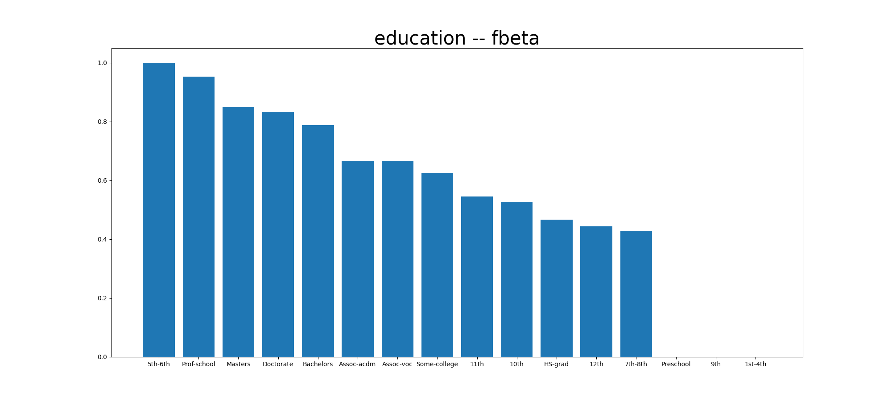

# Model Card

For additional information see the Model Card paper: https://arxiv.org/pdf/1810.03993.pdf

## Model Details
Created by Bobby Lumpkin, this model is an LGBMClassifier. It was trained
using GridSearchCV with the following parameter space: `n_estimators_list = list(range(100, 500, 100))`,  `num_leaves_list = list(range(2, 6))`, `learning_rate_list = [0.1, 0.01, 0.001]`. The final model parameters are
`learning_rate = 0.1`, `n_estimators = 400`, `num_leaves = 5`.

## Intended Use
This model is to be used by myself and any others to predict salary classification (>50k, <=50k>) from other demographic attributes.

## Training Data
The training data consists of ublicly available Census Bureau data -- data/cesnsus.csv train, split using `sklearn.model_selection.train_test_split` with `random_state=123`.

## Evaluation Data
The evaluation data consists of publicly available Census Bureau data -- data/cesnsus.csv trest, split using sklearn.model_selection.train_test_split with random_state=123.

## Metrics
For the total population (evaluation set) the model metrics are:
* precision = 0.79
* recall = 0.65
* fbeta = 0.71.

For the categorical variable "education" slice metrics are provided 
below:

## Ethical Considerations
Model performance seems to vary notable across education levels. Expecially
considering the categories "9th", "Preschool" and "1st-4th". Users should
be cautious about using this model for the purposes of drawing conclusions
about these populations. In the same vein, it is not recommended to use
this model for purposes that would materially impact the lives of those
in the scored population, e.g. credit approval.

## Caveats and Recommendations
In the future, more ideation and experimentation around model architecture
and training can be considered, along with testing additional features.
This might help to improve performance overall and within variable
slices.
